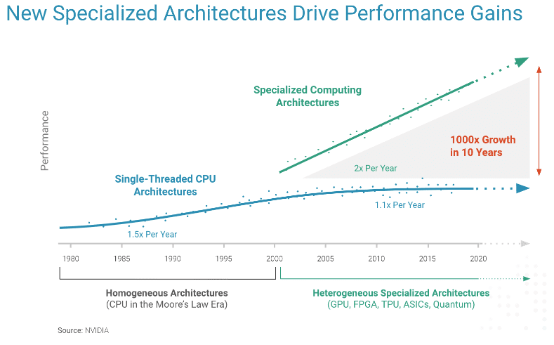

I recently explored the MLIR (Multi-Level Intermediate Representation) Transform dialect. The framework enables control over compiler transformations, at different levels of abstraction. It also utilizes the concept of a *schedule* to manage complex transformation sequences within the IR. This approach provides engineers with fine grained control over transformations enabling the optimization of code for a wide range of architectures.

## What is the Transform Dialect?
 The MLIR transform dialect is designed to enable precise control over compiler transformations by using the compiler IR itself. This approach allows transformations to be embedded with the IR being transformed, an approach that doesn't require rebuilding the compiler. 
 
 The main goal of the Transform dialect is to orchestrate fine-grain transformations on individual operations or sets of operations within the IR. Traditional compiler passes can be thought of as a "monolithic black box" that apply transformations to the entire program. Whereas the Transform dialect enables finer control over optimizations for a more targeted approach.

## Why the Transform Dialect?
 In order to fully utilize the hardware capabilities, target specific compiler optimizations must be leveraged. During compilation, domain specific knowledge can be incorporated to squeeze even more performance out of the hardware. Nowadays, programmers are mostly limited to using high level compiler directives like `pragmas` to influence passes. This rigid approach lacks modularity and extensibility, meaning that low level program optimizations must be performed for each and every target platform. Additionally, the Transform dialect incurs less than 2.6% compile time overhead while providing robust and scalable features.

## The End of Moore's Law
 For decades, computer performance was riding the transistor shrinking wave. As transistors got smaller, chips could pack more and more transistors per unit area. The slowing down of Moore's law has left engineers looking for new ways of obtaining more performance improvements. 
  
  

 The end of Moore's law paves the way for specialization and hardware acceleration. Since general purpose hardware is at a saturation point, computing systems now offload certain tasks and workloads to specialized units called accelerators. As opposed to general purpose processing units, accelerators are built with a single specific usage in mind. For example, we are experiencing firsthand the rise of SoCs that integrate all kinds of processors and different heterogeneous systems tailored for domain specific workloads. 
 
 The complexity needed to manage this ever growing compute platform diversity is not trivial. However, with the help of the compiler, we can bridge the gap between high level software constructs and lower level platform specific implementations. Given the current landscape, frameworks such as LLVM and MLIR aim to consolidate, standardize and solve many of the problems caused by the ever increasing number of specialized architectures. 

ADD IMAGE

## Payload and Schedule Approach
 The transform dialect is not the first to separate the payload (ie. program) from the schedule (ie. the transformations performed on the program), in fact frameworks such as Halide, TVM, and TACO have been using this concept before the existence of the Transform dialect. Although, they seperate the schedule from the payload, these frameworks focus on domain specific optimizations, have predefined software stacks and are not well integrated into a generic compiler unlike the Transform dialect. The goal is to provide a general purpose solution that can be deployed for various envrionments and targets.

## Modularity and Extensibility
 The MLIR Transform dialect is designed with modularity at its core. Users have the ability to define new transformations that can integrate seamlessly into existing workflows. One of the standout features is its extensibility. Users can inject additional operations into the dialect using mechanisms like `TransformDialectExtension`, allowing for custom transformations without altering the core dialect. Additionally, users can compose new transformations by combining existing ones or creating entirely new operations. This allows for precise control over compiler transformations and facilitates the highly iterative workflows needed for research purposes. 

## Hardware Specific Optimizations and Search Methods
 In practice, the transform dialect can be used to perform a sequence of optimizations that result in efficient code generation for MLIR operations. The Transform Dialect is particularly effective in optimizing linear algebra computations such as matrix multiplication and convolution. 
 
 Composing existing transformations can lead to highly efficient code tailored to specific architectures. Furthermore, the Transform dialect allows for the customization of compiler transformations to best use the characteristics of the target hardware such as the cache block size or the number of registers. This flexibility is crucial for maximizing performance across a wide range of accelerators.

 The separation of the payload and schedule allows for the use of search methods to explore optimization spaces effectively. This enables autotuning transformation parameters with the goal of finding the most optimal set of parameters on specific workloads and for specific targets.
 

## Challenges and Learning Curve
 While the transform dialect offers powerful capabilities, it requires a solid understanding of MLIR's infrastructure. Familiarity with existing transformation patterns and how they interact with the transform dialect is crucial for effectively leveraging its potential. 

 For most of my time, I have treated compilers as a black box, passing in an input file and getting a binary in return. Taking a compiler course has sparked my interest even further. More recently, I have been spending time reading about LLVM and MLIR. Despite the steep learning curve, I believe these to be important and promising frameworks I need to add to my arsenal.

For those interested in diving deeper, I recommend starting with MLIR's basic tutorials before tackling the transform dialect. It's a rewarding journey that opens up new possibilities in compiler design and optimization.